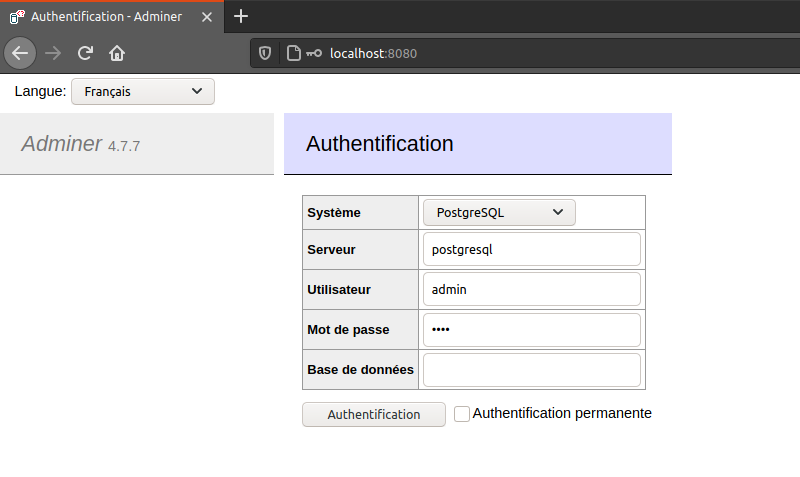
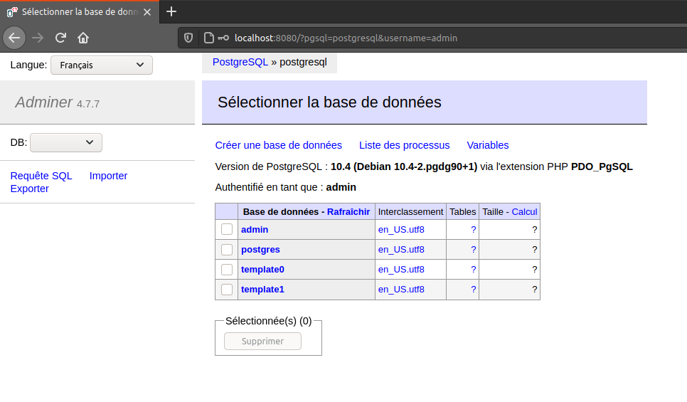

# ezrun-postgresql
Ez run PostgreSQL

*Caution, this is a quick and easy deployment intended for prototyping, not suitable for production*

## Pre-requisites

Install Docker and Docker-Compose:

```bash
$ sudo apt install docker
$ sudo chmod 666 /var/run/docker.sock
$ sudo apt install docker-compose
```

*Caution, this is a quick and dirty way to install them, not suitable for production*

## How to use

```bash
$ git clone git@github.com:rdujardin/ezrun-postgresql.git
$ cd ezrun-postgresql
$ docker-compose up -d
```

This runs two containers :

* postgresql: the postgresql service, listening on port 5432, persisting data in the *data* folder
* adminer: a web interface to administrate the postgresql instance, accessible on port 8080

The default user:password is `admin:1234`.





## How to configure

Simply edit the *docker-compose.yml* to configure.
